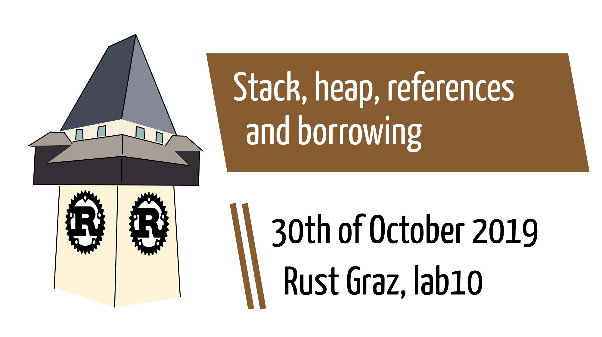
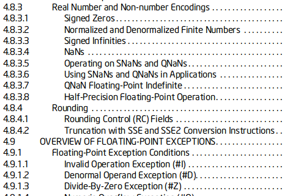
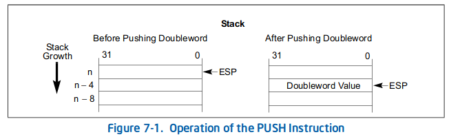
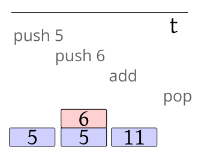
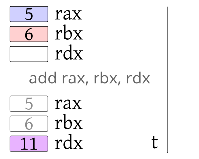
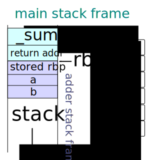

---

# Prologue

---

## Clarification 1: float ranges

→ [std::ops::Range](https://doc.rust-lang.org/std/ops/struct.Range.html). Reminder:

```rust
assert_eq!((3..5), std::ops::Range { start: 3, end: 5 });
assert_eq!(3 + 4 + 5, (3..6).sum());

let arr = [0, 1, 2, 3, 4];
assert_eq!(arr[ ..  ], [0,1,2,3,4]);
assert_eq!(arr[ .. 3], [0,1,2    ]);
assert_eq!(arr[ ..=3], [0,1,2,3  ]);
assert_eq!(arr[1..  ], [  1,2,3,4]);
assert_eq!(arr[1.. 3], [  1,2    ]);
assert_eq!(arr[1..=3], [  1,2,3  ]);
```

---

## Clarification 1: float ranges

→ [std::ops::Range](https://doc.rust-lang.org/std/ops/struct.Range.html)

**start:** Idx ⇒ The lower bound of the range (inclusive). <br/>
**end:** Idx ⇒ The upper bound of the range (exclusive).

* `pub fn contains<U>(&self, item: &U) -> bool`
* `pub fn is_empty(&self) -> bool` [nightly only!]

But e.g. one of the implementations is
`impl<A> Iterator for Range<A> where A: Step`

```rust
let mut numbers = 1..100;
assert_eq!(numbers.nth(42), Some(42));
```

---

## Clarification 1: float ranges

Exhaustive list of implementors of <code>std::iter::Step</code>:

* `i8`, `u8`
* `i16`, `u16`
* `i32`, `u32`
* `i64`, `u64`
* `i128`, `u128`
* `isize`, `usize`

No floats 😔

---

## Clarification 1: float ranges

```rust
error[E0277]: the trait bound `{float}: std::iter::Step` is not satisfied
 --> range.rs:2:14
  |
2 | for i in 2.7 .. 3.1 {
  |          ^^^^^^^^^^ the trait `std::iter::Step`
  |                 is not implemented for `{float}`
  |
  = help: the following implementations were found:
    <i128 as std::iter::Step> <i16 as std::iter::Step>
    <i32 as std::iter::Step>  <i64 as std::iter::Step> and 8 others
  = note: required because of the requirements on the impl
    of `std::iter::Iterator` for `std::ops::Range<{float}>`

error: aborting due to previous error

For more information about this error, try `rustc --explain E0277`.
```

---

## Clarification 1: float ranges

You can print them though!

```rust
println!("{}", 2.7 .. 3.1);
println!("{}", std::ops::Range { start: 2.7, end: 3.1 });
```

gives

```rust
2.7..3.1
2.7..3.1
```

---

## Clarification 1: float ranges

Custom float range implementation:

```rust
#[derive(Debug,Clone,Copy)]
struct IterableFloat {
    start: f64,
    end: f64,
    step: f64,

    init: bool,
    value: f64,
}
```

---

## Clarification 1: float ranges

```rust
impl IterableFloat {
    fn default() -> IterableFloat {
        IterableFloat {
            start: 2.7, end: 3.1, step: 0.1,
            init: true, value: 2.7,
        }
    }
    fn from_to(start: f64, end: f64, step: f64)
                              -> IterableFloat {
        IterableFloat {
            start: start, end: end, step: step,
            init: true, value: start,
        }
    }
}
```

---

## Clarification 1: float ranges

```rust
impl Iterator for IterableFloat {
    fn next(&mut self) -> Option<IterableFloat> {
        if !self.init {
            return None
        }
        if self.value + self.step > self.end {
            return None
        }
        self.value += self.step;
        Some(self.clone())
    }
}
```

---

## Clarification 1: float ranges

Using this iterator:

```rust
fn main() {
    let ifloat = IterableFloat::default();
    //println!("{:?}", ifloat.next().unwrap());

    for f in ifloat {
        println!("{:?}", f);
    }

    for f in IterableFloat::from_to(2.7, 3.1, 0.1) {
        println!("{:?}", f);
    }
}
```

---

## Clarification 2: negative ranges

What does it print?

```rust
fn main() {
    for i in 1..-5 {
        println!("{}", i);
    }
}
```

<p class="fragment">Nothing.</p>

---

## Clarification 2: negative ranges

Simply unsupported.

---

## Clarification 3: step sized ranges

```rust
fn main() {
    for i in (3..10).step_by(2) {
        println!("{}", i);
    }
}
```

BTW, `step_by(0)` is a runtime error (also in release mode).

---

## Clarification 3: step sized ranges

```rust
fn main() {
    for i in (1..-5).step_by(-1) {
        println!("{}", i);
    }
}
```

---

## Clarification 3: step sized ranges

```
error[E0600]: cannot apply unary operator `-` to type `usize`
 --> step_by.rs:2:30
  |
2 |     for i in (1..-5).step_by(-1) {
 cannot apply unary operator `-` ^^
  |
  = note: unsigned values cannot be negated

error: aborting due to previous error

For more information about this error, try `rustc --explain E0600`.
```

---

## Clarification 4: How to return non-zero exit codes

```rust
fn main() {
    std::process::exit(3);
}
```

<blockquote><p style="font-size:34px">Note that because this function never returns, and that it terminates the process, no destructors on the current stack or any other thread's stack will be run. If a clean shutdown is needed it is recommended to only call this function at a known point where there are no more destructors left to run.</p></blockquote>

---

## Clarification 5: The never data type

```rust
pub fn exit(code: i32) -> !
```

* `!` is called [never](https://doc.rust-lang.org/nightly/std/primitive.never.html)
* `break`, `continue` and `return` expressions have type `!`
* What does `Result<!, E>` represent?

---

## Clarification 5: The never data type

From the library of cryptic source code (compiles only in nightly):

```rust
#![allow(unused)]
#![feature(never_type)]
fn main() {
  fn foo() -> u32 {
    let x: ! = {
      return 123
    };
  }
}
```

---

## Addendum 6: Vector preallocation

My own question: How to preallocate a [Vec](https://doc.rust-lang.org/std/vec/struct.Vec.html#method.with_capacity)?

```Go
// Go, preallocate a byte slice
data := make([]byte, 0, 10)
fmt.Printf("%d\n", len(data))
fmt.Printf("%d\n", cap(data))
```

```rust
// rust, preallocate a vector
let mut data = Vec::with_capacity(10);
assert_eq!(data.len(), 0);
for i in 0..10 {
    data.push(i);
}
data.push(11);  // might reallocate
```

---

# Dialogue: borrowing and references

OS/processor support ⇒ memory allocation ⇒ memory safety ⇒ borrowing

---

## CPU architectures

* x86/i386/IA-32 (Intel 8086, 1978)
* amd64/x86_64 (&gt;95% desktop computers, 2000)
* ARM Cortex (Raspberry PI, smartphone)
* RISC-V (first, major open source CPU architecture)

We can build CPUs using AND/XOR/NOT/… gates. FlipFlops allows us to store state temporarily.
A CPU consists of ALUs, state machines, …. A program is stored in main memory and an instruction pointer points to the currently executed instruction.

---

## CPU architectures

Awesome fun fact:

Current state of the art is [5 nm](https://en.wikipedia.org/wiki/Orders_of_magnitude_(length)#1_nanometre) technology – as of October 2018, the average half-pitch of a memory cell expected to be manufactured circa 2019-2020

*History:* 90nm → 65nm → 45nm → 32nm <br/> → 22nm → 14nm → 10nm → 5nm → 3nm

---

## Instruction Set Architecture (ISA)

* An ISA specifies the instructions understood by the CPU (interface between hardware &amp; software)
* ISAs/CPUs compete in feature-richness, implementation complexity and speed
* Compilers (rustc, gcc, …) take your high-level program and convert it into CPU instructions.
* RISC (reduced instruction set computer) versus CISC (complex instruction set computer)

---

## CPU architectures

RISC → e.g. RISC-V, PowerPC <br/>
CISC → e.g. x86

_Example instruction:_ **MOV** - Move data between general-purpose registers; move data between memory and general-purpose or segment registers; move immediates to general-purpose registers [via x86_64 ISA (4922 pages)](https://software.intel.com/en-us/download/intel-64-and-ia-32-architectures-sdm-combined-volumes-1-2a-2b-2c-2d-3a-3b-3c-3d-and-4)

---

## CPUs and memory

* An ISA defines how to address registers, main memory and I/O
* OS: every process assumes it has the entire memory available

    * my machine: 16GB
    * separation in physical/virtual addresses
    * is an important security mechanism
    * memory is organized in pages, 4kB on Linux in my case

---

## x86_64

```
64-bit register | Lower 32 bits | Lower 16 bits | Lower 8 bits
==============================================================
rax             | eax           | ax            | al
rbx             | ebx           | bx            | bl
rcx             | ecx           | cx            | cl
rdx             | edx           | dx            | dl
rsi             | esi           | si            | sil
rdi             | edi           | di            | dil
rbp             | ebp           | bp            | bpl
rsp             | esp           | sp            | spl
r8              | r8d           | r8w           | r8b
r9              | r9d           | r9w           | r9b
r10             | r10d          | r10w          | r10b
r11             | r11d          | r11w          | r11b
r12             | r12d          | r12w          | r12b
r13             | r13d          | r13w          | r13b
r14             | r14d          | r14w          | r14b
r15             | r15d          | r15w          | r15b
```

x86_64 registers via [stackoverflow](https://stackoverflow.com/a/1753627)

---

## x86_64

* Data Transfer Instructions
* Binary Arithmetic Instructions
* Decimal Arithmetic Instructions
* Logical Instructions
* Shift and Rotate Instructions
* Bit and Byte Instructions
* Control Transfer Instructions
* String Instructions
* I/O Instructions …

In total: between [981 and 3683 instructions (x86_64)](https://stefanheule.com/blog/how-many-x86-64-instructions-are-there-anyway/)

---

## x86_64



---

## x86_64

Fun fact:

[mov is Turing-complete](http://stedolan.net/research/mov.pdf)

⇒ [M/o/Vfuscator - The single instruction C compiler](https://github.com/xoreaxeaxeax/movfuscator)

---

## RISC-V

<blockquote style="font-size:30px">
<p>RISC-V ("risk-five") is an open-source hardware instruction set architecture (ISA) based on established reduced instruction set computer principles.</p>
<p>The project began in 2010 at the University of California, Berkeley, but many contributors are volunteers not affiliated with the university.</p>
<p>As of June 2019, version 2.2 of the user-space ISA and version 1.11 of the privileged ISA are frozen, permitting software and hardware development to proceed. A debug specification is available as a draft, version 0.3.</p>
</blockquote>

via [Wikipedia](https://en.wikipedia.org/wiki/RISC-V)

---

## RISC-V

RISC-V is a [_Load-store architecture_](https://en.wikipedia.org/wiki/Load%E2%80%93store_architecture): Arithmetic instructions can only operate on registers, not memory. Thus, instructions fall in two categories:

* _memory access_ (load and store between memory and registers)
* _ALU operations_ (which only occur between registers)

RV32I, RV32E, RV64I, RV128I. And about 15 extensions in 2.2 release.

---

## RISC-V example

```
# int offset, val, s;
# int *addr;

main:
    ADDI t0, zero, 1     # int step_size = 1;
    ADDI t1, zero, 0     # int i = 0;
    ADDI t2, zero, array # int ref = &array;
    JAL zero, test       # goto test;
```

---

## RISC-V example

```
test:
    LW t6, n             # s = n;
    BLT t1, t6, body     # if (i < s) goto body;
    LW t6, sum           # s = sum;
    SW t6, 0x7FC(zero)   #// write s to stdout
    EBREAK               #// return main routine
    
n:     .word 4           # number of elements in n
array: .word 3, 4, 5, 6  # array to sum up
sum:   .word 0           # sum should finally be 18 == 0x12
```

---

## RISC-V example

```
body:
    SLL t3, t1, t0       # offset = i << 1
    SLL t3, t3, t0       # offset = offset << 1
                         # offset in t3 now contains i*4
    ADD t4, t3, t2       # addr = &array[offset]
    LW t4, 0(t4)         # val = *addr;
    LW t6, sum           # s = *sum;
    ADD t6, t6, t4       # s = s + val;
    SW t6, sum           # *sum = s;
    ADDI t1, t1, 1       # i++;
```

<!--
  Ask how to rewrite a if-then into assembly instructions
-->

---

## RISC-V compilation

Install RISC-V backend: `rustup target add riscv32imac-unknown-none-elf`

```
error[E0463]: can't find crate for `std`
  |
  = note: the `riscv64imac-unknown-none-elf` target may not be installed

error: aborting due to previous error

For more information about this error, try `rustc --explain E0463`.
```

😓 I still don't know how to compile for RISC-V.

---

## Assembling rust with x86_64

Another example:

```rust
fn main() {
    let x = 5;
    let y = 6;
    println!("{}", x + y);
}
```

---

## Assembling rust with x86_64

```
$ rustc --print target-spec-json
        -Z unstable-options assembly.rs
{ "arch": "x86_64",
  "cpu": "x86-64",
  "data-layout": "e-m:e-i64:64-f80:128-n8:16:32:64-S128",
  "dynamic-linking": true,
… "llvm-target": "x86_64-unknown-linux-gnu",
… "os": "linux",
  "position-independent-executables": true,
… "stack-probes": true,
  "target-c-int-width": "32",
  "target-endian": "little",
  "target-family": "unix",
  "target-pointer-width": "64",
  "vendor": "unknown" }
```

---

## Assembling rust with x86_64

⇒ Executables are compiled for a specific operating system on a specific CPU architecture

```
% rustc test.rs
% file test
test: ELF 64-bit LSB shared object, x86-64, version 1
(SYSV), dynamically linked, interpreter /lib64/l,
for GNU/Linux 3.2.0, BuildID[sha1]=3ec8f851df61d55cd16c48b66daf85560b626506, 
with debug_info, not stripped
% objdump -d test | grep -A 8 main
```

---

## Assembling rust with x86_64

Remark: There are two assembly notations. You are going to see “AT&amp;T/GAS syntax”, not “Intel syntax”

```
0000000000004140 <main>:
    4140: 50                    push   %rax
    4141: 48 63 c7              movslq %edi,%rax
    4144: 48 8d 3d 45 ff ff ff  lea    -0xbb(%rip),%rdi
    414b: 48 89 34 24           mov    %rsi,(%rsp)
    414f: 48 89 c6              mov    %rax,%rsi
    4152: 48 8b 14 24           mov    (%rsp),%rdx
    4156: e8 15 00 00 00        callq  4170 <_ZN3std2rt10lang_start17hc195ea030023a472E>
    415b: 59                    pop    %rcx
    415c: c3                    retq   
    415d: 0f 1f 00              nopl   (%rax)
```

[Wikibooks: GAS syntax](https://en.wikibooks.org/wiki/X86_Assembly/GAS_Syntax)

---

## Assembling rust with x86_64

* `movslq`: The MOVSXD instruction operates on 64-bit data. It sign-extends a 32-bit value to 64 bits. This instruction is not encodable in non-64-bit modes.
* `push`/`pop`: The PUSH, POP, PUSHA, and POPA instructions move data to and from the stack. The PUSH instruction decrements the stack pointer (contained in the ESP register), then copies the source operand to the top of stack (see Figure 7-1).

---

## Assembling rust with x86_64

* `lea`: The LEA (load effective address) instruction computes the effective address in memory (offset within a segment) of a source operand and places it in a general-purpose register.
* `mov`: The MOV (move) and CMOVcc (conditional move) instructions transfer data between memory and registers or between registers
* `callq`: The CALL instruction allows control transfers to procedures within the current code segment (near call) and in a different code segment (far call).

---

## Assembling rust with x86_64

* `retq`: Transfers program control to a return address located on the top of the stack.
* `nopl`: No operation.

---

## Assembling rust with x86_64

Main routine again:

```
<main>:
    push   %rax
    movslq %edi,%rax
    lea    -0xbb(%rip),%rdi
    mov    %rsi,(%rsp)
    mov    %rax,%rsi
    mov    (%rsp),%rdx
    callq  4170 <_ZN3std2rt10lang_start17hc195ea030023a472E>
    pop    %rcx
    retq
    nopl   (%rax)
```

---

## Assembling rust with x86_64

Lessons learned:

* instructions are stored in memory like data
* one instruction after another is executed
* every byte in main memory have an address
* some instructions depend on each other (_data flow dependency_ or _control flow dependency_)
* optimizations are applied
* there is some stack (acc. to the spec)

---

## Assembler

* a stack supports PUSH and POP operations
* PUSH by incrementing a stack pointer (ESP) and initializing a value
* POP by decrementing ESP and copying a value to desired location



---

## Example

Yet another example:

```rust
fn adder(a: i32, b: i32) -> i32 {
    a + b
}

fn main() {
    let _sum = adder(5, 6);
}
```

→ two approaches to execute this

---

## Stack machine



---

## Register machine



---

## Wrap up

* We have seen a lot of low-level instructions.
* Some use registers. Some use some stack.
* A stack is used to organize the memory.
* We wonder how exectuables are organized and how executables are actually run.

---

## The truth

[ELF § File Structure](https://wiki.osdev.org/ELF#File_Structure)

<table>
  <tr><th>.text</th><td>where code stands</td></tr>
  <tr><th>.data</th><td>where global tables, variables, etc. stand</td></tr>
  <tr><th>.bss</th><td>That's where your uninitialized arrays and variable are</td></tr>
  <tr><th>.rodata</th><td>that's where your strings go</td></tr>
</table>

---

## The truth

[ELF § File Structure](https://wiki.osdev.org/ELF#File_Structure)

<table>
  <tr><th>.comment &amp; .note</th><td>just comments put there by the compiler/linker toolchain</td></tr>
  <tr><th>.stab &amp; .stabstr</th><td>debugging symbols & similar information.</td></tr>
</table>

---

## The truth

```C
#include <stdio.h>
#include <stdlib.h>
const int data = 1;
int global = 1;

void recursive(int count) {
    int local = 42;
    printf("local: %p\n", &local);
    if (count > 0)
        recursive(count - 1);
}

int main() {
    printf("function recursive: %p\n", &recursive);
    printf("data: %p\n", &data);
    printf("global: %p\n", &global);
    printf("heap: %p\n", malloc(1024));
    recursive(10);
    return 0;
}
```

---

## The truth

```C
function recursive: 0x400520
data: 0x400694
global: 0x601038
heap: 0x1a5d670
local: 0x7ffc91466058
local: 0x7ffc91466038
local: 0x7ffc91466018
local: 0x7ffc91465ff8
local: 0x7ffc91465fd8
local: 0x7ffc91465fb8
local: 0x7ffc91465f98
local: 0x7ffc91465f78
local: 0x7ffc91465f58
local: 0x7ffc91465f38
local: 0x7ffc91465f18
```

FTR, `0x7fff2de7d148 > 16*1024³`

---


---

## The truth

* So there are different memory sections.
* One is called stack. One is called heap.
* In particular, the stack is used to handle function calls.
* Function calls consist of: arguments, local variables, return addresses, return values

```rust
fn adder(a: i32, b: i32) -> i32 {
    a + b
}

fn main() {
    let _sum = adder(5, 6);
}
```

<!--

## The truth

TODO there is too much wrong about this image, e.g. direction of stack growth


-->

---

## The truth (conclusio)

Storing state:

* We have registers and main memory to store data.
* We need a memory layout maintenance strategy. Stack and heap is one common way.

Implementing function calls:

* Prefer register machines. Sometimes too small. Then stack machines.
* We push and pop: args, locals, return addr and values

---

## The truth (conclusio)

Stack:

* fast allocation
* automatically deallocated
* stack overflow possible

Heap:

* slow allocation (malloc, calloc, realloc, …)
* manual deallocation (free)
* memory leaks possible

---

## An experiment

```C
#include <stdio.h>
  
void func() {
    int a;
    printf("was %d, setting to %d\n", a, 42);
    a = 42;
}

int main() {
    func();
    func();
    return 0;
}
```

---

## An experiment

```
was 0, setting to 42
was 42, setting to 42
```

<p class="fragment">Why is “was 42” set to 42? (→ thing about the stack)</p>

---

## An experiment (in rust)

```rust
fn func() {
    let a;
    println!("was {}, setting to {}\n", a, 42);
    a = 42;
}

fn main() {
    func();
    func();
}
```

---

## An experiment (in rust)

```
warning: value assigned to `a` is never read
 --> stack_experiment.rs:4:5
  |
4 |     a = 42;
  |     ^
  |
  = note: `#[warn(unused_assignments)]` on by default
  = help: maybe it is overwritten before being read?

error[E0381]: borrow of possibly uninitialized variable: `a`
 --> stack_experiment.rs:3:41
  |
3 |     println!("was {}, setting to {}\n", a, 42);
  |                                         ^ use of possibly uninitialized `a`

error: aborting due to previous error

For more information about this error, try `rustc --explain E0381`.
```

boring 😒

---

## Memory safety issues

* There is uninitialized memory.
* Stack has predictable structure. Heap does not.
* Data is code. Code is data.

→ all these are subject to attacks in IT security

We want countermeasures. rust provides more than C.

---

## Memory safety: C versus rust

C:

* implicit [de]allocation on the stack
* malloc/… and free for the heap

rust:

* implicit [de]allocation on the stack with stronger notion of scopes {} and lifetimes
* explicit heap allocation with Box types living in a scope

---

## Box type example

```rust
struct Point {
    x: u32,
    y: u32,
}

fn main() {
    let stack_pt: Point =
                    Point { x: 10, y: 10 };
    let heap_pt: Box<Point> =
           Box::new(Point { x: 10, y: 10 });
    println!("{:p}", &stack_pt);
    println!("{:p}", &heap_pt);
}
```

---

## Concept 1: References

References are memory addresses. Unlike C, there is no pointer arithmetic in safe rust.
You can only print memory addresses. Unlike C, rust does automatic dereferencing.

```rust
fn func() {}

fn main() {
  let f = &func;
  let local1 = 5;
  let local2 = 6;

  println!("func: {:p}", f);         //func: 0x558670c3c570
  println!("local1: {:p}", &local1); //local1: 0x7ffc4f6f18a8
  println!("local2: {:p}", &local2); //local2: 0x7ffc4f6f18ac
}
```

---

## Concept 1: References

We copy 5 and 6 as data. Add them. Return them as data. “Call by value”.

There are no references.

```rust
fn add(a: i32, b: i32) -> i32 {
    a + b
}

fn main() {
    println!("5 + 6 = {}", add(5, 6));
}
```

---

## Concept 1: References

We provide two references (memory addresses) as argument.
rust automatically dereferences them for addition.

```rust
fn add(a: &i32, b: &i32) -> i32 {
    return a + b;
}

fn main() {
    println!("5 + 6 = {}", add(&5, &6));
}
```

---

## Concept 1: References (in C)

```C
#include <stdio.h>
  
int add(int *a, int *b) {
    return *a + *b;
}

int main() {
    int a = 5;
    int b = 6;
    printf("%d\n", add(&a, &b));
    return 0;
}
```

---

## Concept 1: References (in C)

* `&5` and `&6` do not work in C
* we need to explicitly dereference a pointer/reference

    * might yield a null pointer dereference
    * in rust usually automatically (you can also write `*a + *b`)

*Follow-up question:* Are references mutable?

---

## Concept 1: References

```rust
fn adder(a: &i32, b: &i32) -> i32 {
    a = b;
    a + b
}
```

---

## Concept X: Lifetimes

```
error[E0623]: lifetime mismatch
 --> test.rs:2:9
  |
1 | fn adder(a: &i32, b: &i32) -> i32 {
  |             ----     ---- these two types are
  |          declared with different lifetimes...
2 |     a = b;
  |         ^ ...but data from `b` flows into `a` here

error: aborting due to previous error
```

<p class="fragment">What are lifetimes? → talk in the future.</p>

---

## Concept 1: References

References are immutable unless you make it a `&mut` reference.

```rust
fn adder(a: &mut i32, b: &mut i32) -> i32 {
    a = b;
    a + b
}

fn main() {
    println!("{}", adder(&mut 5, &mut 6));
}
```

---

## Concept 1: References

But they have different semantics:

```
error[E0369]: binary operation `+` cannot be applied to type `&mut i32`
 > test.rs:3:7
  |
3 |     a + b
  |     - ^ - &mut i32
  |     |
  |     &mut i32
  |
  = note: an implementation of `std::ops::Add` might be missing for `&mut i32`

error: aborting due to previous error

For more information about this error, try `rustc --explain E0369`.
```

---

## Concept 1: References

You could do:

```rust
fn adder(a: &mut i32, b: &mut i32) -> i32 {
    a = b;
    *a + *b
}

fn main() {
    println!("{}", adder(&mut 5, &mut 6));
}
```

→ `*` explicitly dereferences an address

---

## Concept 1: References

… but you still run into lifetimes, again.

```rust
error[E0623]: lifetime mismatch
 --> ref.rs:2:9
  |
1 | fn adder(a: &mut i32, b: &mut i32) -> i32 {
  |             --------     -------- these two types are declared with different lifetimes...
2 |     a = b;
  |         ^ ...but data from `b` flows into `a` here

error: aborting due to previous error
```

<p class="fragment">→ references can be mutable/immutable. Let's forget about the details for now.</p>

---

## Concept 1: References

Dereferencing is defined by the type implementation (→ Deref trait).
You cannot arbitrarily dereference values.

```rust
fn main() {
    let a = 5;
    let b = 6;

    let mut c = &a;
    c = &b;
    println!("{}", c);
}
```

---

## Concept 1: References

And all operations are scope-based.

```rust
let mut x = 5;
{
    let y = &mut x;
    *y += 1;
}
println!("{}", x);
```

---

## Concept 1: References

References to functions are possible …

```rust
fn fn1() {}
fn fn2() {}

fn main() {
    let mut a = fn1;
    a = fn2;
}
```

---

## Concept 1: References

```
error[E0308]: mismatched types
 --> test.rs:6:9
  |
6 |     a = fn2;
  |         ^^^ expected fn item, found a different fn item
  |
  = note: expected type `fn() {fn1}`
             found type `fn() {fn2}`

error: aborting due to previous error

For more information about this error, try `rustc --explain E0308`.
```

… but difficult to get right (→ scoping).

---

## Concept 2: Borrowing

* rust's distinctive memory safety mechanism
* each value in Rust has a variable that’s called its _owner_.
* there can only be one owner at a time.
* when the owner goes out of scope, the value will be dropped.

⇒ “ownership”

---

## Concept 2: Borrowing

`b`, `c` and `d` are aliases of `a`.

```rust
fn main() {
    let mut a = Vec::new();
    a.push(42);

    let b = &a;
    let c = &a;
    let d = &a;
}
```

---

## Concept 2: Borrowing

`b` is mutating `a`.

```rust
fn main() {
    let mut a = Vec::new();
    a.push(42);

    let b = &mut a;
    b.push(31);
}
```

---

## Concept 2: Borrowing

Borrowing rules:

* one or more references (`&T`) to a resource,
* exactly one mutable reference (`&mut T`).

Either or, not both!

<!--

## Borrowing

```rust
let mut x = 5;
//{
    let y = &mut x;
    *y += 1;
//}
println!("{}", x);
```
-->

---

## Data races

> There is a ‘data race’ when two or more pointers access the same memory location at the same time, where at least one of them is writing, and the operations are not synchronized.

Borrowing prevents data races.

---

## Concept 2: Borrowing

A binding that borrows something does not deallocate the resource when it goes out of scope.

```rust
// This function takes ownership of a box and destroys it
fn eat_box_i32(boxed_i32: Box<i32>) {
    println!("Destroying box that contains {}", boxed_i32);
}

// This function borrows an i32
fn borrow_i32(borrowed_i32: &i32) {
    println!("This int is: {}", borrowed_i32);
}
```

---

## Concept 2: Borrowing

```rust
fn main() {
  // Create a boxed i32, and a stacked i32
  let boxed_i32 = Box::new(5_i32);
  let stacked_i32 = 6_i32;

  // Borrow the contents of the box. Ownership is
  // not taken, so the contents can be borrowed again.
  borrow_i32(&boxed_i32);
  borrow_i32(&stacked_i32);
```

---

## Concept 2: Borrowing

```rust
  {
    // Take a reference to the data contained
    // inside the box
    let _ref_to_i32: &i32 = &boxed_i32;

    // Error! Can't destroy `boxed_i32` while
    // the inner value is borrowed later in scope.
    eat_box_i32(boxed_i32); // FIXME Comment out

    // Attempt to borrow `_ref_to_i32` after
    // inner value is destroyed
    borrow_i32(_ref_to_i32);
    // `_ref_to_i32` goes out of scope and
    // is no longer borrowed.
  }
```

---

## Concept 2: Borrowing

```rust
  // `boxed_i32` can now give up
  // ownership to `eat_box` and be destroyed
  eat_box_i32(boxed_i32);
}
```

---

# Epilogue

---

## Quiz

<dl>
<dt>Name some CPU architecture.</dt>
<dd class="fragment">x86, amd64, ARM, PowerPC</dd>
<dt>Which are the (dis)advantages of the stack/heap?</dt>
<dd class="fragment"><em>Stack:</em> speed, no memory leaks; <em>Heap:</em> size arbitrary at compile time</dd>
<dt>What is a return address?</dt>
<dd class="fragment">memory location of instruction to execute after function returns</dd>
<dt>What is borrowing?</dt>
<dd class="fragment">Memory safety concept where every value has an owner and the owner can borrow values</dd>
<dt>Who defines how to dereference a reference?</dt>
<dd class="fragment">The type implementation</dd>
</dl>

---

## Next session

Wed, 2019/11/27 19:00

Show of hands:

* **Topic 1:** Strings, string types and UTF-8
* **Topic 2:** Type systems and traits
* **Topic 3:** Data structure implementations
